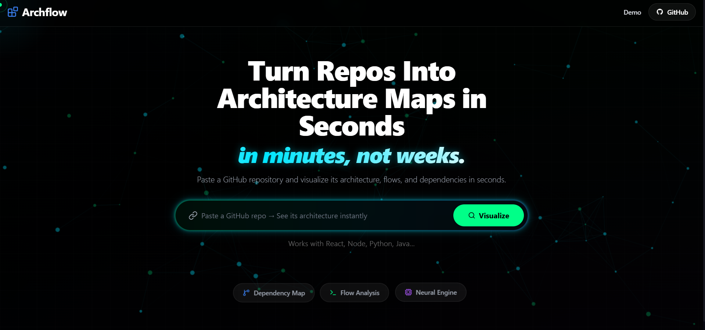
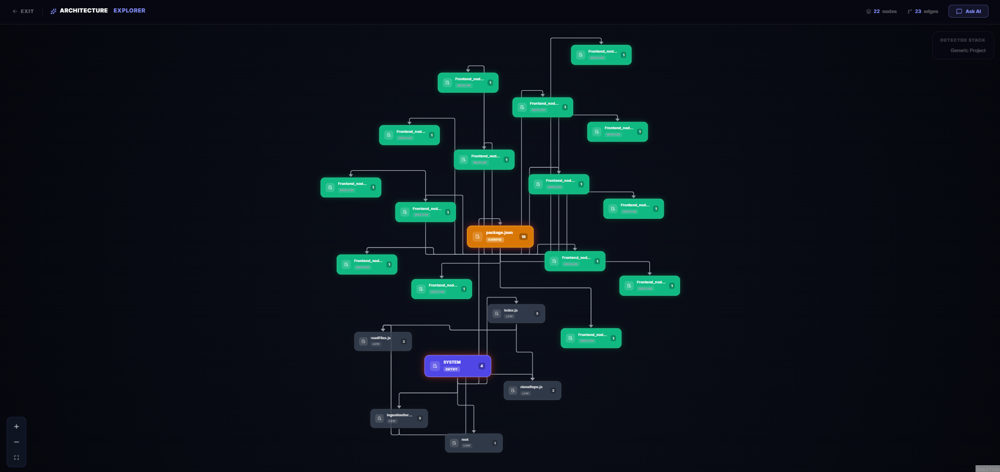
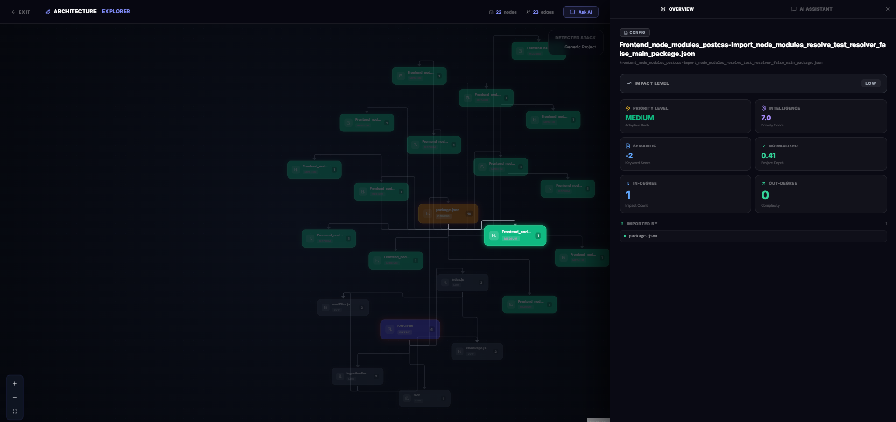

# Archflow — Codebase Architecture Explorer

Archflow is an AI-powered codebase visualization tool that transforms any GitHub repository into an interactive architecture graph. It helps developers quickly understand project structure, dependencies, and critical components without manually reading the entire codebase.

---

## Overview

Archflow analyzes a repository and builds a structured graph where:

- Nodes represent files or modules
- Edges represent dependencies and relationships
- Priority and impact are visually encoded
- AI provides contextual explanations and insights

This enables fast onboarding, debugging, and architectural understanding.

---

## Key Features

### Architecture Graph Visualization
- Interactive graph built using dependency analysis
- Automatic layout with clustered relationships
- Visual hierarchy based on importance and connectivity

### Intelligent Node Classification
- Nodes categorized into:
  - High Priority (Core logic)
  - Medium Priority (Supporting modules)
  - Low Priority (Utility or isolated files)
- Special handling for configuration files like `package.json`

### AI-Powered Insights (Groq Integration)
- Natural language queries over the codebase
- Context-aware explanations of files and modules
- System overview generation using repository structure

### Dependency Mapping
- Import/export analysis across files
- Identification of entry points and critical flows
- Graph-based representation of system architecture

### Resilient Backend Pipeline
- GitHub API ingestion
- Graph building and pruning logic
- Fallback mechanisms for missing files (e.g., package.json injection)

---

## Screenshots

### Homepage

### Architecture Graph

### Node Analysis Panel

---

## System Architecture

### Backend
- Repository ingestion using GitHub API
- Graph construction and normalization
- Priority scoring engine
- Groq AI integration with:
  - Rate limiting
  - Caching
  - Fallback logic

### Frontend
- React-based UI
- Graph rendering with interactive nodes
- AI assistant panel
- Real-time query handling via backend API

---

## AI Integration Strategy

- Groq is used as an enhancement layer, not a dependency
- Strict governance:
  - Rate limiting
  - Session and daily quotas
  - Response validation
  - Timeout control

If AI fails or is restricted, deterministic logic ensures system stability.

---

## Core Design Principles

- Deterministic fallback first, AI enhancement second
- Zero UI-side intelligence — backend is the source of truth
- Isolation of features to prevent cross-impact
- Performance-aware graph pruning and prioritization

---

## Use Cases

- Understanding unfamiliar repositories
- Debugging complex dependency chains
- Identifying critical modules quickly
- Preparing for interviews and code reviews
- Visualizing architecture for documentation

---

## Future Enhancements

- Multi-repository comparison
- Monorepo-aware visualization
- Advanced clustering and grouping
- Persistent graph storage
- Team collaboration features

---

## Author

Sujal Patil
